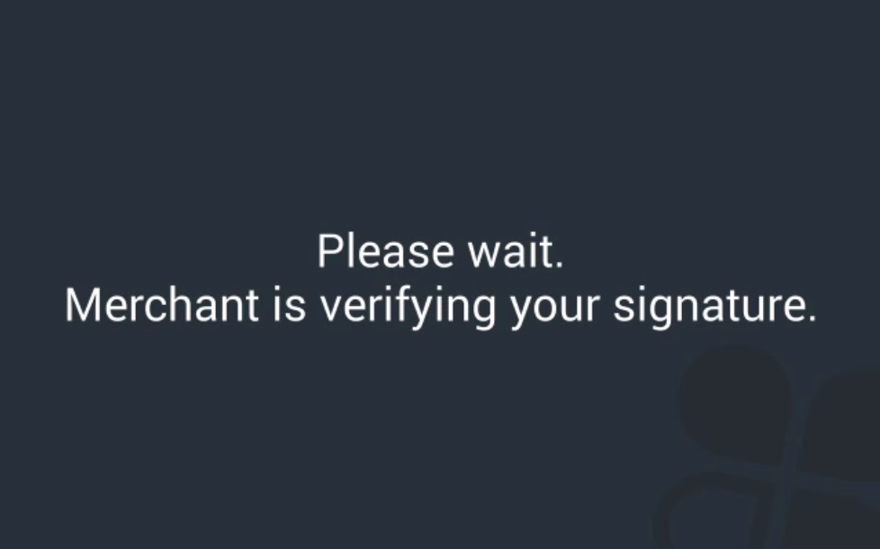
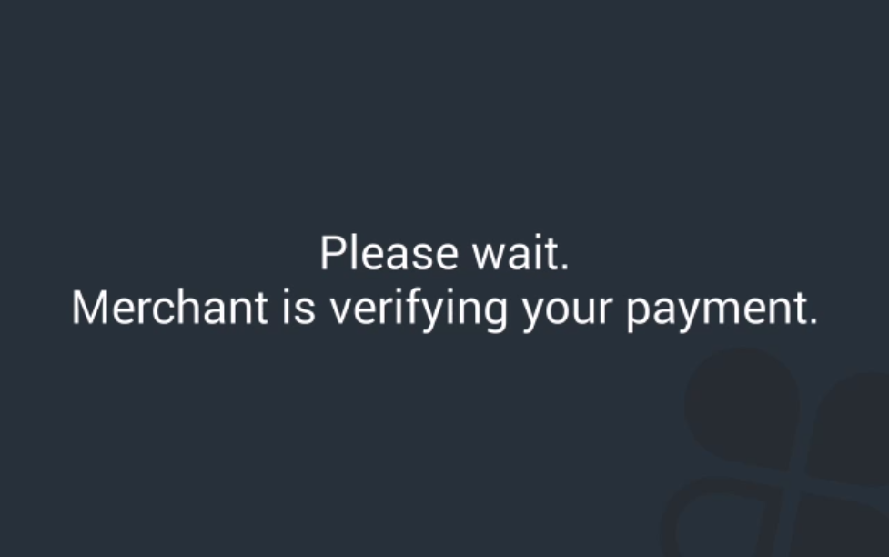

# Clover CodeLab: Remote Pay Cloud

## Before You Start

### What You'll Build

This codelab shows a simple integration of a browser-based point-of-sale (POS) system with a Cloud Pay Display-compatible Clover device (Clover Mini, Mobile, or Flex). A [Clover Developer Kit (DevKit)](https://cloverdevkit.com/) is required for this tutorial.

The repo includes a simple, prebuilt UI. In its current state, it doesn't do anything. In this tutorial, you'll build the ability to connect to a Clover device and process transactions.

It is important to complete this tutorial in its entirety. You'll learn how to build an integration, as well as implementation best practices, so you can avoid common mistakes and edge cases. The tutorial is comprehensive and may take a few hours to complete and understand. Ultimately, this tutorial is meant to help you ship quality code to production with confidence.

This tutorial uses the remote-pay-cloud SDK's  [`CloverConnector`](https://clover.github.io/remote-pay-cloud-api/3.0.0/remotepay.ICloverConnector.html) interface to connect to a Clover device and perform operations via the cloud. The CloverConnector provides a consolidated asynchronous interface for your POS to integrate with Clover's customer-facing payment devices.

### Prerequisites

The guide assumes basic familiarity with HTML and JavaScript, but you should be able to follow along even if you haven't used them before.

To keep this tutorial lightweight and easy to understand, it is agnostic of any frontend JavaScript framework. As a result, some adaptation may be required to implement the same behavior in your own POS, depending on your tech stack.

Before beginning, read the following topics:

* [Overview of the Clover Platform](https://docs.clover.com/clover-platform/docs/clover-architecture)
* [Clover Development Basics](https://docs.clover.com/clover-platform/docs/clover-development-basics-web-app)
* [API Usage & Rate Limits](https://docs.clover.com/clover-platform/docs/api-usage-rate-limits)

Your [DevKit](https://cloverdevkit.com/) needs to be set up [using these instructions](https://docs.clover.com/clover-platform/docs/setting-up-your-devkit). **NOTE:** An emulator cannot be used because Remote Pay Cloud interfaces with applications that rely on Clover hardware to function correctly.

Our JavaScript remote-pay-cloud SDK is distributed as an npm package. If you do not already have npm installed, [install it](https://www.npmjs.com/get-npm).

### How to Follow Along

Keep this document open to follow along while completing the tutorial in your favorite text editor. As you progress, making and saving JavaScript changes, the POS will automatically reload in your browser of choice.

### Help, I'm Stuck!

If you get stuck, try the following troubleshooting actions: 

* Check the browser's developer console for error messages
* Hard reload the POS page
* Exit the Cloud Pay Display app on the device

If that doesn't resolve the issue, visit Clover's [Developer Community](https://community.clover.com/) and search for your problem. If you don't find someone with the same question, post a new one, and we'll help you out.

With this out of the way, let's get started!

__________

## Setup

On your Clover DevKit, open the More Tools app. Search for and install the **Cloud Pay Display** application from the App Market. After launching Cloud Pay Display on your DevKit, go ahead and touch the four corners of the device's screen to exit the app. When it re-launches programmatically, you'll know you've accomplished the first major milestone of this tutorial: device pairing.

`git clone https://github.com/clover/codelab-remote-pay-cloud.git` to clone this repository locally. `cd codelab-remote-pay-cloud` to navigate to the project's root directory, and then run `npm install`. This will install `webpack` and `webpack-dev-server`, along with Clover's `remote-pay-cloud` and `remote-pay-cloud-api` libraries, which are needed to connect to and communicate with the device.

Run `npm run build` to start `webpack-dev-server`, which will bundle your files and enable hot reloading.

Open a new browser tab and [log in to your Sandbox developer account](https://sandbox.dev.clover.com/home/login). From the drop-down menu in the upper-right corner, select your test merchant. From your test merchant's Clover dashboard, click More Tools to launch the App Market. Find the **CodeLab: Remote Pay Cloud** app in the App Market. Install and launch it, and Clover will redirect you to https://localhost:8080, including a few query parameters with the redirect that we will explain shortly. The page displays a simple point-of-sale system.


**Note:** These query parameters are required for device pairing, and some are generated when the app is launched for that session. If you do not complete this tutorial in one browser session, you will need to re-launch the CodeLab: Remote Pay Cloud application from your test merchant's Clover dashboard to resume your progress. If you stopped webpack-dev-server, you will also need to navigate to this project's root directory in your command line, and re-execute `npm run build`.

Open the project's `public` directory in your favorite text editor and open `index.js`.

## Getting Started

### Device Pairing

First, we need to build the device pairing functionality between our POS and the Clover customer-facing device.

The POS has a 'Connect' button that has a bound `onclick` handler to invoke a `connect()` function, which we have defined in `index.js`. The complete `connect()` function will pair the POS and the Clover device.

To successfully `connect()` to the Clover device, the following parameters are required:

* The `merchant_id`
* An `access_token`
* The `targetCloverDomain` (Clover's sandbox or production environment)
* The `remoteApplicationId` of the POS
* The `deviceId` of the Clover device you're connecting to; this is different than the device's serial number
* A `friendlyId`, which is a human-readable way to identify the POS

The `merchant_id` was passed to your POS as a query parameter when you launched your POS from your test merchant's Clover dashboard. Grab it using regex, and assign it to a property of the `RemotePayCloudTutorial` object that gets instantiated when the page loads (see `index.html`).

```diff
RemotePayCloudTutorial = function() {
- // TODO: Set instance variables for CloverConnector configuration.
+ this.merchant_id = window.location.href.match(/merchant_id=([^&]*)/)[1];
};
```

The `access_token` was also passed to your POS as a query parameter. This is because the CodeLab application does not have a backend server, so it's configured to redirect with an `access_token` rather than a `code`. To read more about how to securely obtain an `access_token` using your own POS's backend server, please reference our [OAuth documentation](https://docs.clover.com/clover-platform/docs/using-oauth-20).

```diff
RemotePayCloudTutorial = function() {
  this.merchant_id = window.location.href.match(/merchant_id=([^&]*)/)[1];
+ this.access_token = window.location.href.match(/access_token=([^&]*)/)[1];
};
```

The `client_id` was also passed to your POS as a query parameter. If you are using a `code` response type, as previously mentioned, you would need this `client_id` to obtain an `access_token`. Since you already have an `access_token`, you can ignore this query parameter.

Clover maintains [different environments for Sandbox and Production](https://docs.clover.com/clover-platform/docs/developer-accounts). The `targetCloverDomain` specifies which one you would like to connect to. This tutorial targets the sandbox environment; the production environment can be used only by your final deployed web application.

```diff
RemotePayCloudTutorial = function() {
  this.merchant_id = window.location.href.match(/merchant_id=([^&]*)/)[1];
  this.access_token = window.location.href.match(/access_token=([^&]*)/)[1];
+ this.targetCloverDomain = window.location.href.includes("localhost") ? "https://sandbox.dev.clover.com" : "https://www.clover.com";
};
```

The `remoteApplicationId` is a value specific to your POS application. It is used by Clover's engineering team to track SDK usage and investigate issues. Learn more about creating your own `remoteApplicationId` [here](https://docs.clover.com/clover-platform/docs/create-your-remote-app-id). For this tutorial, we'll provide our CodeLab app's `remoteApplicationId`, but in your own semi-integrated POS, this value needs to be replaced with your unique `remoteApplicationId`.

```diff
RemotePayCloudTutorial = function() {
  this.merchant_id = window.location.href.match(/merchant_id=([^&]*)/)[1];
  this.access_token = window.location.href.match(/access_token=([^&]*)/)[1];
  this.targetCloverDomain = window.location.href.includes("localhost") ? "https://sandbox.dev.clover.com" : "https://www.clover.com";
+ this.remoteApplicationId = "CLOVERDEV.655VQ41Z9CVF8";
};
```

The `friendlyId` is a human-readable way to identify the current POS. Certain error messages will include `friendlyId`s. For example, if a Clover device is currently connected to a POS via Cloud Pay Display, and a *different* POS attempts to initiate a connection, the second POS will receive an error message stating that the Clover device is already connected to first POS' `friendlyId`. For this tutorial, use the value `Primary POS`.

```diff
RemotePayCloudTutorial = function() {
  this.merchant_id = window.location.href.match(/merchant_id=([^&]*)/)[1];
  this.access_token = window.location.href.match(/access_token=([^&]*)/)[1];
  this.targetCloverDomain = window.location.href.includes("localhost") ? "https://sandbox.dev.clover.com" : "https://www.clover.com";
  this.remoteApplicationId = "CLOVERDEV.655VQ41Z9CVF8";
+ this.friendlyId = "Primary POS";
};
```

The `deviceId` was *not* passed as a query parameter. It's associated with (but different from) the device's serial number, so a merchant cannot manually enter this value. Instead, you can use Clover's [REST API](https://docs.clover.com/clover-platform/docs/making-rest-api-calls) to fetch all of the devices associated with the merchant. By rendering the serial numbers as `option`s, the merchant can choose which device to connect to. Then, the app will connect to the `deviceId` associated with the serial number that the merchant selects.

First, we'll create an empty `select` element above the 'Connect' button that we'll eventually populate with those `option`s.

In `index.html`:

```diff
<div class="row">
  <div class="col-10 offset-1 col-md-5 offset-md-0 col-lg-4 offset-lg-1 pos--container tdshadow top24">
    <div class="col-12 p-0 mt-2">
-      <!-- TODO: Insert select element here. -->
+      <select id="select--clover-device-serials">
+      </select>
    </div> 
```

`DOMContentLoaded` is a suitable event for fetching the device information of all Clover devices belonging to the merchant. Once you have that information, create an `<option>` to be rendered in the DOM for each serial number. The `value` of each `<option>` will be the `deviceId`, which is the parameter needed to connect to the device. Add those `<option>`s to the `<select>` we just created.

At the bottom of `events.js`:

```diff
  helloWorldKey.addEventListener("click", function() {
    remotePayCloudTutorial.showHelloWorld();
  });
+
+ fetch(`${remotePayCloudTutorial.targetCloverDomain}/v3/merchants/${remotePayCloudTutorial.merchant_id}/devices?access_token=${remotePayCloudTutorial.access_token}`)
+ .then(function(response) {
+   return response.json();
+ })
+ .then(function(data) {
+   var select = document.getElementById("select--clover-device-serials");
+ 
+   data.elements.forEach(function(device) {
+     if (device.serial === "unknown") {
+       // Exclude Clover emulators.
+       return;
+     } else {
+       var option = document.createElement("option");
+       option.text = device.serial;
+       option.value = device.id;
+       select.add(option);
+     }
+   });
+ })
+ .catch(function(error) {
+   window.alert(error.toString());
+ });
```

**Important:** Getting data from the `/devices` endpoint requires the *MERCHANT_R* permission. When you installed the Codelab app to your test merchant account, you granted the app this permission. Without it, you would have received a `401 Unauthorized` response. Read more about properly configuring permissions in your own POS [here](https://docs.clover.com/clover-platform/docs/permissions).

**Note:** In the above implementation, you created an `<option>` for each of the merchant's devices (except [emulators](https://docs.clover.com/build/android-emulator-setup/)). However, you may want to only render `<option>`s for the Clover devices compatible with Cloud Pay Display (currently, Clover Mini, Mobile, and Flex), and exclude other devices (currently, Clover Station and Clover Station 2018). In that case, the following code snippet could be used. As Clover continues to develop new hardware, we may release additional devices that are not Cloud Pay Display eligible. As a result, the following code is **not future-proof**, should be used at your own risk, and might require patching in the future. Only use this code snippet in your POS if you understand the associated risks.

```javascript
fetch(`${remotePayCloudTutorial.targetCloverDomain}/v3/merchants/${remotePayCloudTutorial.merchant_id}/devices?access_token=${remotePayCloudTutorial.access_token}`)
.then(function(response) {
  return response.json();
})
.then(function(data) {
  var select = document.getElementById("select--clover-device-serials");

  data.elements.forEach(function(device) {
    // Currently, Clover Mobile, Mini, and Flex are compatible with Cloud Pay Display.
    // Their serial numbers begin with C02, C03, and C04, respectively.
    var serialFirstThree = device.serial.slice(0, 3);

    // Clover Station and Clover Station 2018 have serial numbers that begin with
    // C01 and C05. They will likely never use Cloud Pay Display
    // because they are not the best form factors for a customer-facing screen.
    // Additionally, Clover emulators have a serial of 'unknown' or begin with 'EMULATOR'.

    var ineligibleDevicesFirstThree = ["C01", "C05", "unk", "EMU"];
    if (ineligibleDevicesFirstThree.includes(serialFirstThree)) {
      // Exclude Clover Stations, Clover Station 2018s, and Clover emulators.
      return;
    } else {
      var option = document.createElement("option");
      option.text = device.serial;
      option.value = device.id;
      select.add(option);
    }

    // As Clover continues to develop new hardware,
    // we may release additional devices that are not Cloud Pay Display eligible.
    // This code block is not future-proof and
    // should only be used at your own risk.
  });
})
.catch(function(error) {
  window.alert(error.toString());
});
```

**Important:** The remote-pay-cloud SDK was developed for one-to-one pairing between POS and Clover device. For best results, do not attempt to pair your POS with multiple Clover devices simultaneously.

You now have all of the data that is required to initialize a connection, so now you need to give the green 'Connect' button functionality. This will allow your app to connect to the `deviceId` of the currently selected `option` in the `select` element previously created. 

In `index.js`:

```diff
RemotePayCloudTutorial.prototype.connect = function() {
-  // TODO: Create a configuration object, a CloverConnector, a 
-  // CloverConnectorListener, and then initialize the connection.
+  var deviceId = document.getElementById("select--clover-device-serials").value;
+
+  var args = [this, this.remoteApplicationId, deviceId, this.merchant_id, this.access_token, this.friendlyId];
+
+  var cloverConnectorFactoryConfiguration = {};
+  cloverConnectorFactoryConfiguration[clover.CloverConnectorFactoryBuilder.FACTORY_VERSION] = clover.CloverConnectorFactoryBuilder.VERSION_12;
+  var cloverConnectorFactory = clover.CloverConnectorFactoryBuilder.createICloverConnectorFactory(cloverConnectorFactoryConfiguration);
+
+  // Instantiate a cloverConnector instance using a list of arguments that must
+  // be entered in this order.
+  // In ES6, spread syntax would be a good replacement for .bind.apply();
+  this.cloverConnector = cloverConnectorFactory.createICloverConnector(new (Function.prototype.bind.apply(clover.WebSocketCloudCloverDeviceConfigurationBuilder, args)));
+
+  this.cloverConnector.initializeConnection();
};
```

This code accomplishes a few tasks. First, it obtains the `deviceId` of the currently selected serial number. Next, it creates an ordered array of arguments required to instantiate a `CloverConnector`
. Then, it configures the `CloverConnectorFactory` with a property (`clover.CloverConnectorFactoryBuilder.FACTORY_VERSION = clover.CloverConnectorFactoryBuilder.VERSION_12`) to specify the current version of the `CloverConnector`. Finally, it instantiates the `CloverConnector` with both the `args` and the help of JavaScript's `apply` method, and initializes its connection.

When `cloverConnector.initializeConnection()` is called, the remote-pay-cloud SDK instantiates a WebSocket connection to the Clover cloud. To follow WebSocket best practices, your app needs to properly dispose of resources when the merchant navigates to a different page, refreshes the current page, or closes the tab/window. [window.onbeforeunload](https://developer.mozilla.org/en-US/docs/Web/API/WindowEventHandlers/onbeforeunload) is the proper `WindowEventHandler` to handle all of these events.

```diff
RemotePayCloudTutorial.prototype.connect = function() {
  var deviceId = document.getElementById("select--clover-device-serials").value;
  
  var args = [this, this.remoteApplicationId, deviceId, this.merchant_id, this.access_token, this.friendlyId];

  var cloverConnectorFactoryConfiguration = {};
  cloverConnectorFactoryConfiguration[clover.CloverConnectorFactoryBuilder.FACTORY_VERSION] = clover.CloverConnectorFactoryBuilder.VERSION_12;
  var cloverConnectorFactory = clover.CloverConnectorFactoryBuilder.createICloverConnectorFactory(cloverConnectorFactoryConfiguration);
  
  // Instantiate a cloverConnector instance using a list of arguments that must
  // be entered in this order.
  // In ES6, spread syntax would be a good replacement for .bind.apply();
  this.cloverConnector = cloverConnectorFactory.createICloverConnector(new (Function.prototype.bind.apply(clover.WebSocketCloudCloverDeviceConfigurationBuilder, args)));

+ this.setDisposalHandler();
  this.cloverConnector.initializeConnection();
};
+
+ RemotePayCloudTutorial.prototype.setDisposalHandler = function() {
+   window.onbeforeunload = function(event) {
+     try {
+       this.cloverConnector.dispose();
+     } catch (e) {
+       console.error(e);
+     }
+   }.bind(this);
+ };
```

Let the web page hot reload, select the device serial you would like to connect to, and then press **Connect**. Cloud Pay Display should launch on the device, indicating that you successfully paired the POS and device. Congratulations!

**Important:** Subsequent hot reloads will sever the connection between your POS and Clover device. From now on, you will need to use the 'Connect' button to reconnect to your device following every page reload.

**Note:** Did Cloud Pay Display not launch automatically? Ensure that your Clover device is [connected to the Internet](https://help.clover.com/troubleshoot/troubleshoot-your-wireless-network-internet-connection/), and check the browser's developer console for error messages. If you are still unable to connect to your Clover device, please reference our [Clover Developer Community](https://community.clover.com/).

### Implement a CloverConnectorListener

In order to send data from your POS to the Clover device, you will invoke methods on the `CloverConnector` instance. You've already become familiar with `CloverConnector#initializeConnection`.

However, one-way communication is not enough. The device also sends payloads of data to your POS through the WebSocket connection. You'll need to implement a `CloverConnectorListener` to respond to events, keep track of the device's state, and know if transactions succeeded or failed. Your POS will receive information about the Clover device by implementing a number of different callbacks.

This example sets a `CloverConnectorListener` on the `CloverConnector` instance before initializing the connection. It can also be useful to set a pointer to the `cloverConnector` on the `CloverConnectorListener` instance, so that `cloverConnector` methods can be easily invoked from directly within a `CloverConnectorListener` callback.

First, you should implement the `onDeviceConnected` and `onDeviceReady` callbacks, which are invoked sequentially during the device pairing process. The following code updates the UI to indicate that device pairing was successful. It also implements the `onDeviceError` callback, so that any Clover error messages are shown to the merchant, as well as `onDeviceDisconnected`.

```diff
+ this.setCloverConnectorListener(this.cloverConnector);
  this.setDisposalHandler();
  this.cloverConnector.initializeConnection();
};
+
+  RemotePayCloudTutorial.prototype.setCloverConnectorListener = function(cloverConnector) {
+    var CloverConnectorListener = function(connector) {
+      clover.remotepay.ICloverConnectorListener();
+      this.cloverConnector = connector;
+    };
+
+    CloverConnectorListener.prototype = Object.create(clover.remotepay.ICloverConnectorListener.prototype);
+    CloverConnectorListener.prototype.constructor = CloverConnectorListener;
+
+    CloverConnectorListener.prototype.onDeviceConnected = function() {
+      document.getElementById("status-message").innerHTML = "Device is connected!";
+    };
+
+    CloverConnectorListener.prototype.onDeviceReady = function() {
+      document.getElementById("status-message").innerHTML = "Device is connected and ready!";
+    };
+
+    CloverConnectorListener.prototype.onDeviceError = function(deviceErrorEvent) {
+      window.alert(`Message: ${deviceErrorEvent.getMessage()}`);
+    };
+
+    CloverConnectorListener.prototype.onDeviceDisconnected = function() {
+      document.getElementById("status-message").innerHTML = "Device is disconnected!";
+    };
+
+    this.cloverConnectorListener = new CloverConnectorListener(cloverConnector);
+    cloverConnector.addCloverConnectorListener(this.cloverConnectorListener);
+  };
```

After the page refreshes, reconnect to your device. A "Device is connected and ready!" message should appear. `onDeviceConnected` and `onDeviceReady` are occasionally invoked very rapidly, to the point where you may never see the "Device is connected!" message on the DOM. However, slow network speeds can contribute to latency and delay.

**Important:** *Never* invoke a `CloverConnector` method from within the `CloverConnectorListener#onDeviceReady` callback. This callback is **not** guaranteed to fire only once, and unintended consequences will arise if you start multiple `TransactionRequest`s concurrently.

### Hello World

The POS already has a **Hello World** button on its DOM, and it already has an `onclick` handler. To give it basic functionality, use `cloverConnector#showMessage`.

In `index.js`:

```diff
RemotePayCloudTutorial.prototype.showHelloWorld = function() {
-  // TODO: Show a 'Hello World' message on the device.
+  this.cloverConnector.showMessage("Hello World");
};
```

Refresh the page, reconnect to the device, and wait for the device to be connected and ready. Click **Hello World** and verify that "Hello World" is rendered on the Clover device. In your app, the `showMessage` method can be used to display a custom welcome message or a deal of the day.

This message will not disappear until another `CloverConnector` method is invoked, so let's invoke `showWelcomeScreen` after a three-second timeout.

```diff
RemotePayCloudTutorial.prototype.showHelloWorld = function() {
   this.cloverConnector.showMessage("Hello World");
+  setTimeout(this.cloverConnector.showWelcomeScreen.bind(this.cloverConnector), 3000);
};
```

Reconnect to the device, wait for it to be ready, and click **Hello World** again. After three seconds, the device should transition back to the Welcome screen.

### Initiating a sale

You are now ready to start a Sale, one of the three transaction types that Clover semi-integration supports. You can learn more about the different [transaction types](https://docs.clover.com/clover-platform/docs/transaction-types) in the docs. Starting a Sale requires you to instantiate a `SaleRequest`, which inherits from the `TransactionRequest` class.

The POS already has a **Charge** button, but it does nothing. In `events.js`, add functionality to the `onclick` handler that parses the `total` into an `int` and starts a Sale:

```diff
chargeKey.addEventListener("click", function() {
+  var amount = parseInt(document.getElementById("total").innerHTML.replace(".", ""));
+  // 'amount' is an int of the number of cents to charge.
+  if (amount > 0) {
+    remotePayCloudTutorial.performSale(amount);
+  }
});
```

We'll interact with the actual `cloverConnector` API in `index.js`. Note that you must set an `ExternalId` on the `SaleRequest`. The `ExternalId` serves a number of different purposes:

1. Your POS can use it to associate your `Order` and `Payment` models with Clover's `Payment` objects.
2. It helps prevent accidental duplicate charges. The Clover device will reject back-to-back `TransactionRequest`s that have identical `ExternalId`s.
3. If you use universally unique `ExternalId`s on every transaction, they can be used as a last resort to help Clover investigate a particular transaction. Providing the transaction's Clover `PaymentId` will resolve issues quicker. In rare cases, your POS may know the `ExternalId` of a `TransactionRequest`, but not its Clover `PaymentId` (for example, if connectivity between the POS and Clover device is dropped mid-transaction).

For these reasons, **you should persist both the ExternalId and the Clover PaymentId in your database.** `ExternalId`s should be universally unique to ensure they can be used as references for specific transactions. If your POS is not already generating unique payment IDs, the SDK provides a utility method that generates a 13-digit alphanumeric UUID. While universal uniqueness is not guaranteed, the method has a very low chance of collision.

The `ExternalId` is required on every `TransactionRequest`, and it must have a length between 1 and 32 characters.

Add the following in `index.js`:

```diff
RemotePayCloudTutorial.prototype.performSale = function(amount) {
-  // TODO: Use the CloverConnector to initiate a sale.
+  var saleRequest = new clover.remotepay.SaleRequest();
+  saleRequest.setAmount(amount);
+  saleRequest.setExternalId(clover.CloverID.getNewId());
+  this.cloverConnector.sale(saleRequest);
};
```

After the web page reloads, re-establish a connection to the device, enter an amount into the calculator, and press **Charge**. You should see instructions on the Clover device to process your first card transaction. Use the test card to pay and follow the on-screen instructions.

After you add a signature and tap **Done**, you might notice that the device is "stuck" on the verification screen. This is the intended behavior. The Clover device is waiting for the POS to either approve or reject the customer's signature. The POS, rather than the Clover device, needs to handle this approval action, as semi-integrated Clover devices are customer-facing, not merchant-facing.



Exit Cloud Pay Display by touching the four corners of the screen simultaneously. We don't want any of our merchants to get "stuck" at this screen.

**Note:** If you did not see this screen, you'll need to adjust your test merchant's settings and then initiate another Sale to reach this point. After exiting Cloud Pay Display, open the **Setup** app, navigate to **Payments**, and scroll down to **Signature Settings**. Set the **Signature entry location** to 'On tablet screen' and the **Signature requirement** to 'Always require signature'.

### Handling signature verification

In this section, you'll add code to display the captured signature on the POS and provide the merchant with the option of either accepting or rejecting it. Start by opening `index.html` and adding a `<canvas>` element to contain the signature.

```diff
<div class="row">
  <div class="col-12">
    <div class="numpad--key key--secondary p-0 mx-0" id="key--hello-world">
      Hello World
    </div>
  </div>
</div> 

- <!-- TODO: Insert canvas element here. -->
+ <div class="row top24 justify-content-center">
+   <div class="col-10 col-md-4 canvas-container">
+     <canvas ref="canvas" width="300" height="175" id="verify-signature-canvas"/>
+   </div> 
+ </div>
```

Next, implement the `CloverConnectorListener#onVerifySignatureRequest` callback that gets invoked at this stage of the transaction lifecycle. In that method, render the signature on the `canvas` element, and then provide the merchant with the option of either approving or rejecting the signature.

In `index.js`, add the following code:

```diff
CloverConnectorListener.prototype.onDeviceDisconnected = function() {
  document.getElementById("status-message").innerHTML = "Device is disconnected!";
};

+ CloverConnectorListener.prototype.onVerifySignatureRequest = function(verifySignatureRequest) {
+   // Clear any previous signatures and draw the current signature.
+   var canvas = document.getElementById("verify-signature-canvas");
+   var ctx = canvas.getContext('2d');
+   ctx.clearRect(0, 0, canvas.width, canvas.height);
+   ctx.scale(0.25, 0.25);
+   ctx.beginPath();
+   for (var strokeIndex = 0; strokeIndex < verifySignatureRequest.getSignature().strokes.length; strokeIndex++) {
+     var stroke = verifySignatureRequest.getSignature().strokes[strokeIndex];
+     ctx.moveTo(stroke.points[0].x, stroke.points[0].y);
+     for (var pointIndex = 1; pointIndex < stroke.points.length; pointIndex++) {
+       ctx.lineTo(stroke.points[pointIndex].x, stroke.points[pointIndex].y);
+       ctx.stroke();
+     }
+   }
+   // Reset the scale so that clearing the previous signature will function as intended.
+   ctx.scale(4, 4);
+ };
```

Then, we'll present the merchant with the choice of accepting or rejecting the payment in response to the customer's signature. Due to the asynchronous nature of drawing on an HTML canvas, we use `setTimeout()` to enqueue this code in the call stack. Otherwise, the confirm dialog will appear before the signature has been drawn.

```diff
CloverConnectorListener.prototype.onVerifySignatureRequest = function(verifySignatureRequest) {
  // Clear any previous signatures and draw the current signature.
  var canvas = document.getElementById("verify-signature-canvas");
  var ctx = canvas.getContext('2d');
  ctx.clearRect(0, 0, canvas.width, canvas.height);
  ctx.scale(0.25, 0.25);
  ctx.beginPath();
  for (var strokeIndex = 0; strokeIndex < verifySignatureRequest.getSignature().strokes.length; strokeIndex++) {
    var stroke = verifySignatureRequest.getSignature().strokes[strokeIndex];
    ctx.moveTo(stroke.points[0].x, stroke.points[0].y);
    for (var pointIndex = 1; pointIndex < stroke.points.length; pointIndex++) {
      ctx.lineTo(stroke.points[pointIndex].x, stroke.points[pointIndex].y);
      ctx.stroke();
    }
  }
  // Reset the scale so that clearing the previous signature will function as intended.
  ctx.scale(4, 4);
+ 
+ // Present the merchant with the option of approving or rejecting the signature.
+ 
+ // Due to the asynchronous nature of drawing on an html canvas, we need to
+ // enqueue this in the message queue to be executed when the call stack is
+ // empty. otherwise, the confirm dialog will appear before the signature
+ // has rendered.
+ setTimeout(function() {
+   if (confirm("Would you like to approve this signature?")) {
+     // Accept or reject, based on the merchant's input.
+     this.cloverConnector.acceptSignature(verifySignatureRequest);
+   } else {
+     this.cloverConnector.rejectSignature(verifySignatureRequest);
+   }
+ }.bind(this), 0);
};
```

**Important:** When testing signature behavior, use the magnetic stripe test card provided with the Clover DevKit.

Refresh the web page, reconnect to the Clover device, initiate another Sale, and accept the signature. You have now completed your first `remote-pay-cloud` Sale! 🎉 

But don't ship this code to production just yet. Start *another* Sale, proceed through the transaction lifecycle using the **same card** that you just used, and the device displays the same "stuck" verification screen. Exit Cloud Pay Display using a four-finger tap.



### Working with Challenges

A `DUPLICATE_CHALLENGE` is triggered by using the same payment card twice in quick succession. This challenges needs to be handled in the `CloverConnectorListener#onConfirmPaymentRequest` callback. You can read more about working with challenges [here](https://docs.clover.com/build/working-with-challenges/). This sample renders all possible challenges and gives the merchant the option to approve or reject the payment.

If we're resolving the last `Challenge` in the array, we want a merchant input of 'OK' to actually accept the `Payment`.

```diff
    setTimeout(function() {
      if (confirm("Would you like to approve this signature?")) {
        // accept or reject, based on the merchant's input
        this.cloverConnector.acceptSignature(verifySignatureRequest);
      } else {
        this.cloverConnector.rejectSignature(verifySignatureRequest);
      }
    }.bind(this), 0);
  };
+
+  CloverConnectorListener.prototype.onConfirmPaymentRequest = function(confirmPaymentRequest) {
+    for (var i = 0; i < confirmPaymentRequest.getChallenges().length; i++) {
+      // Boolean of whether or not we are resolving the last challenge in the Challenges array
+      var isLastChallenge = i === confirmPaymentRequest.getChallenges().length - 1;
+
+      if (confirm(confirmPaymentRequest.getChallenges()[i].getMessage())) {
+        if (isLastChallenge) {
+          this.cloverConnector.acceptPayment(confirmPaymentRequest.getPayment());
+        }
+      } else {
+        this.cloverConnector.rejectPayment(confirmPaymentRequest.getPayment(), confirmPaymentRequest.getChallenges()[i]);
+        return;
+      }
+    }
+  };
```

Start a new Sale and ensure that you're able to resolve the `DUPLICATE_CHALLENGE`.

### Did the Sale Succeed?

The POS needs to know whether or not the sale succeeded and update the UI accordingly (a production app would also need to store the transaction results in a database). The app uses the `SaleRequest` class and `CloverConnector#sale` method to initiate a transaction. Next, use the `SaleResponse` class and implement the `CloverConnectorListener#onSaleResponse` method to learn how the transaction concluded.

This example uses the [toLocaleString](https://developer.mozilla.org/en-US/docs/Web/JavaScript/Reference/Global_Objects/Number/toLocaleString) method on the JavaScript `Number` class to handle number formatting. Refer to its [browser compatibility table](https://developer.mozilla.org/en-US/docs/Web/JavaScript/Reference/Global_Objects/Number/toLocaleString#Browser_compatibility), and replace it with a different library or code, depending on your POS's preferences and browser compatibility requirements.

Add the following code to `index.js`:

```diff
CloverConnectorListener.prototype.onConfirmPaymentRequest = function(confirmPaymentRequest) {
  for (var i = 0; i < confirmPaymentRequest.getChallenges().length; i++) {
    // boolean of whether or not we are resolving the last challenge in the Challenges array
    var isLastChallenge = i === confirmPaymentRequest.getChallenges().length - 1;
    
    if (confirm(confirmPaymentRequest.getChallenges()[i].getMessage())) {
      if (isLastChallenge) {
        this.cloverConnector.acceptPayment(confirmPaymentRequest.getPayment());
      }
    } else {
      this.cloverConnector.rejectPayment(confirmPaymentRequest.getPayment(), request.getChallenges()[i]);
      return;
    }
  }
};
+ 
+ CloverConnectorListener.prototype.onSaleResponse = function(saleResponse) {
+   if (saleResponse.getSuccess()) {
+     var saleResponseAmount = saleResponse.getPayment().getAmount();
+     var formattedSaleResponseAmount = (saleResponseAmount / 100).toLocaleString("en-US", {style: "currency", currency: "USD"});
+     alert(`Sale was successful for ${formattedSaleResponseAmount}!`);
+   } else {
+     alert(`${saleResponse.getReason()} — ${saleResponse.getMessage()}`);
+   }
+ };
```

A `SaleRequest` will now `alert` when it is complete and whether or not it succeeded. Refresh the page, process another transaction, and you should see the "Sale was successful...!" dialog.

You'll also want to test that failed transactions behave as expected. The test card shipped with your DevKit should *always* succeed. You'll need to manually enter a different test card number in order to simulate a decline at the payment gateway. To do that, you'll need to add a switch to the POS that allows the merchant to toggle whether the Clover device will show a 'Type Card' button and permit manual entry.

In `index.html`, add a `<label>` element that contains the checkbox:

```diff
<div class="row form-inline justify-content-center">
  <div class="col-12">
-    <!-- TODO: Create a checkbox for manual card entry. -->
+    <label>
+      <input type="checkbox" id="checkbox-manual-card-entry"/> Manual card entry?
+    </label>
  </div> 
```

 In `index.js`, add a condition so if the checkbox is selected, the `SaleRequest` is initiated with all card entry methods enabled:

```diff
RemotePayCloudTutorial.prototype.performSale = function(amount) {
  var saleRequest = new clover.remotepay.SaleRequest();
  saleRequest.setAmount(amount);
  saleRequest.setExternalId(clover.CloverID.getNewId());
+  if (document.getElementById("checkbox-manual-card-entry").checked) {
+    saleRequest.setCardEntryMethods(clover.CardEntryMethods.ALL);
+    document.getElementById("checkbox-manual-card-entry").checked = false;
+  }
  this.cloverConnector.sale(saleRequest);
};
```

You can now test how a declined transaction is handled. Connect to the Clover device, enter an amount, select the **Manual card entry?** checkbox, and then click **Charge** to start a sale. On the Clover device, tap the "Type Card" button, and enter the following card information:

```
Card Number: 4005571702222222
CVV: 123
Expiration date: Any date in the future
```

After entering this card information, tap **Done**. The Clover device will show a "Transaction Declined" message. Tap **Done** and you'll return to the payment method selection screen.

By default, the Clover device restarts the transaction on failure, giving the customer the opportunity to try a different card.

Tap the back arrow in the upper-left corner of the payment method selection screen. `onSaleResponse` should trigger an `alert` stating the sale request was canceled.

**Note:** Interchange fees may be higher for manually entered card transactions, compared to swipe/dip/tap. However, we strongly recommend implementing an option in your POS to allow your merchants to enter cards manually. Allowing your merchant to accept manually entered cards can serve as a backup in case the cardholder has a damaged mag stripe or EMV chip.

### Handling Partial Auths

A successful transaction does not guarantee that the entire `amount` of the `SaleRequest` was authorized. For example, a prepaid card might only have enough funds to partially cover the transaction amount. This is called a **partial auth**. Your industry may be more likely to see partial auths depending on the payment options available to cardholders (for example, HSA debit cards may make partial auths more common).

The POS should determine if a partial auth occurred. If it did, a new `SaleRequest` should be initiated for the amount that was *not* paid by the first transaction. This example uses the `localStorage` API to hold the `amount` that was used in the initiating `SaleRequest` and compare it to the amount authorized in its corresponding `SaleResponse`.

Add the following in `index.js`:

```diff
// Perform a sale
RemotePayCloudTutorial.prototype.performSale = function(amount) {
  var saleRequest = new clover.remotepay.SaleRequest();
  saleRequest.setAmount(amount);
  saleRequest.setExternalId(clover.CloverID.getNewId());
  if (document.getElementById("checkbox-manual-card-entry").checked) {
    saleRequest.setCardEntryMethods(clover.CardEntryMethods.CARD_ENTRY_METHOD_MANUAL);
    document.getElementById("checkbox-manual-card-entry").checked = false;
  }
+  // localStorage will store the amount as a string, even though it's an int.
+  window.localStorage.setItem("lastTransactionRequestAmount", amount);
  this.cloverConnector.sale(saleRequest);
};
```

It will be nice to have access to the `performSale` helper method on the `RemotePayCloudTutorial` instance we're creating in `index.js`.

```diff
+ var remotePayCloudTutorial;

// RemotePayCloudTutorial object definition
RemotePayCloudTutorial = function() {
  this.merchant_id = window.location.href.match(/merchant_id=([^&]*)/)[1];
  this.access_token = window.location.href.match(/access_token=([^&]*)/)[1];
  this.targetCloverDomain = window.location.href.includes("localhost") ? "https://sandbox.dev.clover.com" : "https://www.clover.com";
  this.remoteApplicationId = "com.tutorial.remote.pay.cloud";
  this.friendlyId = "Primary POS";
+  remotePayCloudTutorial = this;
};
```

Now, implement the logic for partial auth handling.

```diff
CloverConnectorListener.prototype.onSaleResponse = function(saleResponse) {
  if (saleResponse.getSuccess()) {
+    // Convert the stored string back to an int.
+    var saleRequestAmount = parseInt(window.localStorage.getItem("lastTransactionRequestAmount"));
+    // Returns an int, so comparison is allowed.
    var saleResponseAmount = saleResponse.getPayment().getAmount();
+
+    // A partial auth occurred if the Payment amount was less than the TransactionRequest amount.
+    var wasPartialAuth = saleResponseAmount < saleRequestAmount;
+
    var formattedSaleResponseAmount = (saleResponseAmount / 100).toLocaleString("en-US", {style: "currency", currency: "USD"});
+    if (wasPartialAuth) {
+      var remainingBalance = saleRequestAmount - saleResponseAmount;
+      var formattedRemainingBalance = (remainingBalance / 100).toLocaleString("en-US", {style: "currency", currency: "USD"});
+      alert(`Partially authorized for ${formattedSaleResponseAmount} — remaining balance is ${formattedRemainingBalance}. Ask the customer for an additional payment method.`);
+
+      // Start another sale for the remaining amount.
+      remotePayCloudTutorial.performSale(remainingBalance);
+    } else {
+      alert(`Sale was successful for ${formattedSaleResponseAmount}!`);
+    }
-     alert(`Sale was successful for ${formattedSaleResponseAmount}!`);
  } else {
    alert(`${saleResponse.getReason()} — ${saleResponse.getMessage()}`);
  }
};
```

You'll need to use a particular test card number to test your partial auth logic. Start a sale that allows manual card entry and enter the following card information:

```
Card Number: 4005578003333335
CVV: 123
Expiration date: Any date in the future
```

This card number should pay for half of the `amount`. Tap **Yes** on the Clover device and finish the transaction. The POS recognizes the partial auth and initiates a new `SaleRequest` for the remaining balance. Use the test card to finish the transaction


## Additional Resources
Congratulations! You have now integrated a web-based point-of-sale with a Clover device, performed multiple Sales, and handled the most frequent edge cases. However, the [CloverConnector](https://clover.github.io/remote-pay-cloud-api/1.4.2/remotepay.ICloverConnector.html) is capable of so much more. Here are links to the API documentation and examples that will help you build more features into your POS.

* [remote-pay-cloud SDK repository](https://github.com/clover/remote-pay-cloud/)
* [API documentation](http://clover.github.io/remote-pay-cloud/1.4.3/)
* [API class documentation](https://clover.github.io/remote-pay-cloud-api/1.4.2/)
* [Additional example apps](https://github.com/clover/remote-pay-cloud-examples)
* [Semi-Integration FAQ](https://community.clover.com/spaces/11/semi-integration.html?topics=FAQ)
* [Clover Developer Community](https://community.clover.com/index.html)

## Sources
Wooden background image by [Pixeden](https://www.pixeden.com/graphic-web-backgrounds/wood-pattern-background)